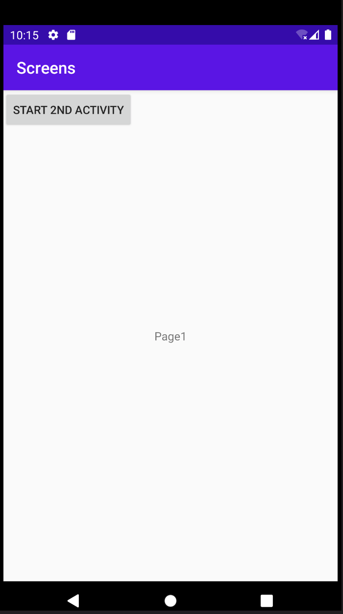
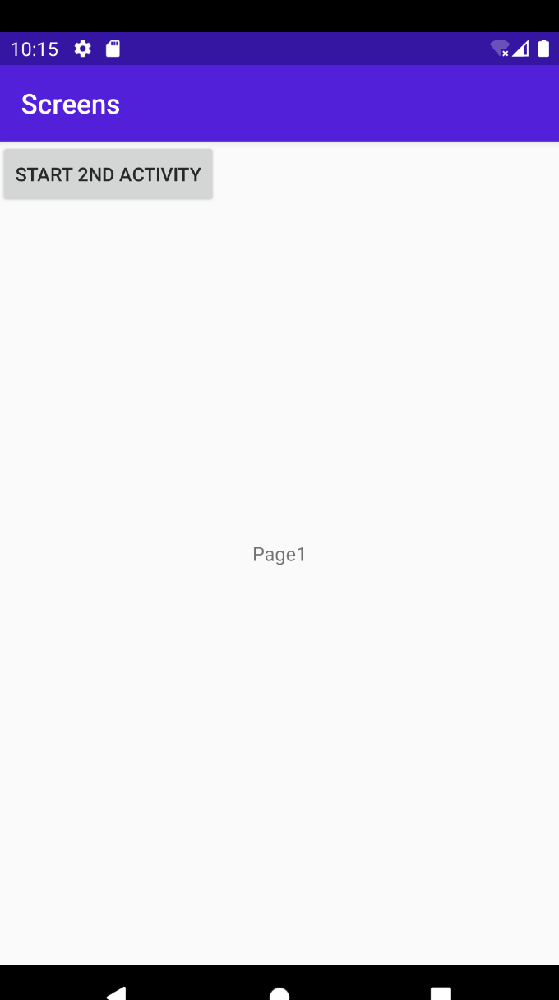

Först skapade jag en ny activity, efter detta så lade jag till en button i min layout. Denna knappen
kopplades då så att den öppnade den andra activityn. Sedan gjorde jag en string och en int som innehöll
datan som skickas med när man trycker på knappen. )

    knapp.setOnClickListener(new View.OnClickListener() {
    @Override
    public void onClick(View v) {
    startActivity(new Intent(MainActivity.this, SecondActivity.class));
    Edda = new Intent(MainActivity.this, SecondActivity.class);
    Edda.putExtra("name", "Petrik"); // Optional
    Edda.putExtra("number",  22 ); // Optional
    startActivity(Edda);

    }});
Det som syns på koden ovan är koden för vad som ska skickas från MainActivity till SecondActivity.
När man klickar på knappen skickas detta och startar den nya activityn.

Efter detta gjorde jag en textView som skulle visa denna datan på den andra sidan.

    Bundle extras = getIntent().getExtras();
    if (extras != null) {
    name = extras.getString("name");
    number = extras.getInt("number");
    textview =findViewById(R.id.textView2);
    textview.setText(Namn+Nummer);

Koden ovan, tagen från SecondActivity visar hur textviewn som visar datan från
MainActivity är uppsatt. 

